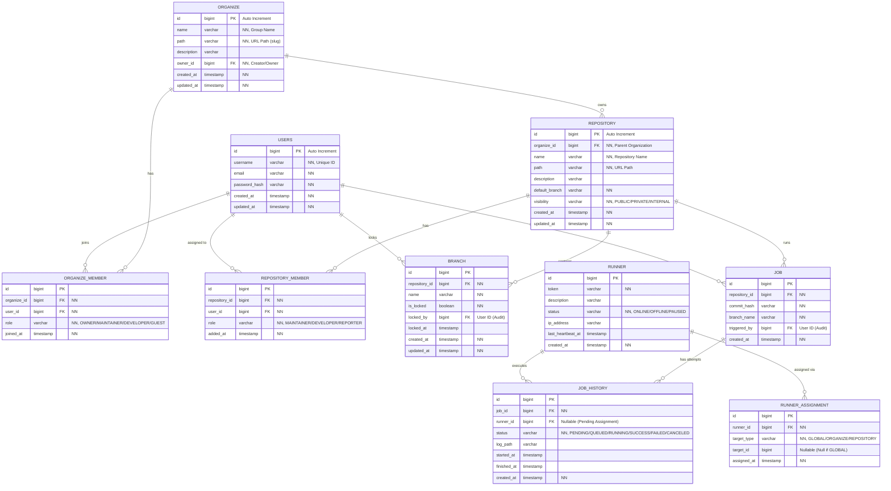

# JGitkins Server ERD

## Logical Design

## Constraints & Business Logic
1.  **Runner Assignment**: 
    *   Runners are not directly linked to a single Repo/Org in the `RUNNER` table.
    *   Instead, `RUNNER_ASSIGNMENT` links a `runner_id` to a `target_id` (which can be an Organization ID or Repository ID).
    *   When dispatching a job, the system checks if there is a runner assigned to the Repository OR the parent Organization.
2.  **Audit**: `BRANCH.locked_by` and `JOB.triggered_by` track user actions.
