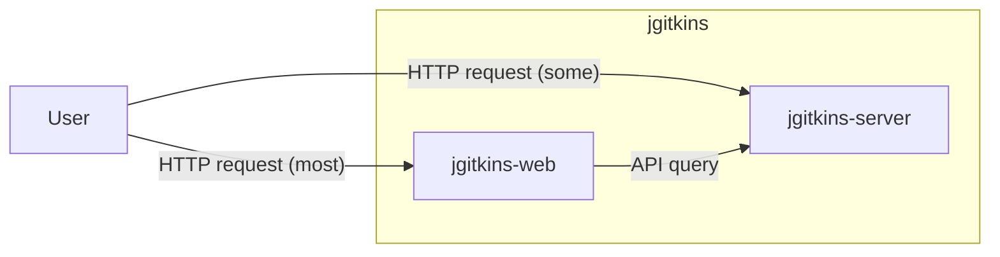

# Architecture

## Request Flow Summary
- A user sends a request to the jgitkins platform.
- The platform routes the request to `jgitkins-web` or `jgitkins-server` based on the request path.
- Most requests go to `jgitkins-web`, which queries `jgitkins-server` when needed.

## Diagram

