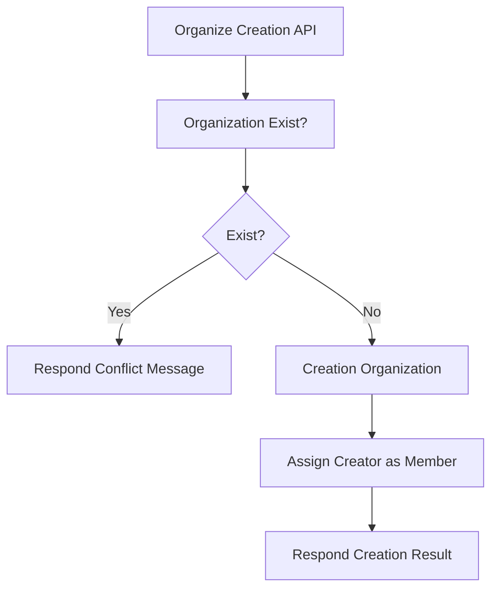

## Organize
### Example (Organize Creation)
> creation organize and assign the user into organize member

```mermaid
flowchart TD
    A[Organize Creation API] --> B[Organization Exist?]
    B --> C{Exist?}
    C -->|Yes| D[Respond Conflict Message]
    C -->|No| E[Creation Organization]
    E --> F[Assign Creator as Member]
    F --> G[Respond Creation Result]


```

## Repository
### Repository Creation

