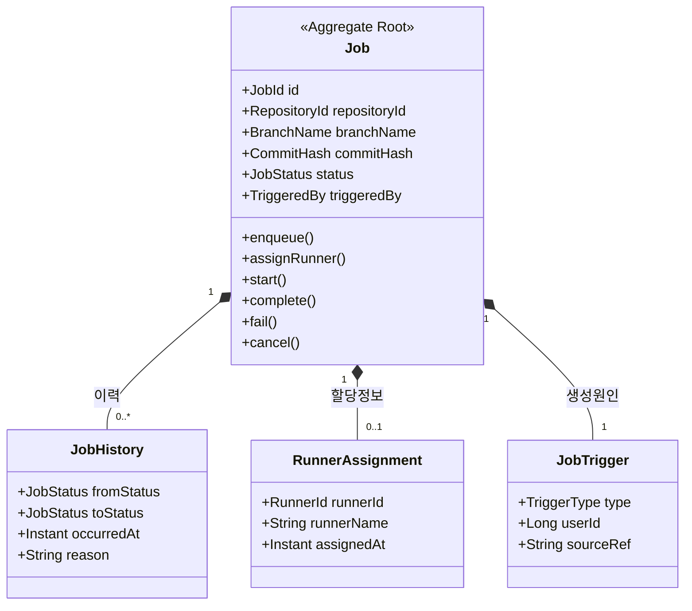

# Job Domain Model

## 목적
- Job 도메인의 핵심 객체, aggregate 경계, 값 객체 관계를 구조적으로 설명함.
- 상태 흐름 문서와 분리하여 객체 책임과 경계를 명확히 보여주기 위함임.
- Push 기반 Job 생성 리팩토링 시 어떤 객체가 코어 모델에 남아야 하는지 판단 기준을 제공함.

## 도메인 모델 구조

## 핵심 해석
- `Job` 은 Aggregate Root 로서 상태 전이와 실행 라이프사이클을 책임지는 핵심 객체임.
- `JobHistory` 는 상태 전이 기록을 보존하는 내부 구성요소이며, 감사 추적과 운영 분석에 활용됨.
- `RunnerAssignment` 는 어느 runner 가 언제 할당되었는지를 설명하는 값 객체 성격을 가짐.
- `JobTrigger` 는 Job 이 어떤 원인으로 생성되었는지 나타내며, Push 기반 생성인지 수동 실행인지 구분할 수 있도록 확장 가능해야 함.

## 경계 관점 메모
- `PushHook`, `ReceiveCommand`, `PushEventRequestResolver` 와 같은 기술 객체는 Job 도메인 모델에 포함되지 않음.
- Push 입력 해석 결과는 `JobTrigger` 또는 별도 순수 command 로 축약되어 코어 모델로 유입되는 것이 바람직함.
- 저장소 물리 경로, HTTP 요청 문맥, JGit 세부 타입은 도메인 모델 경계 밖에 위치해야 함.

## 확장 후보
- `JobDefinition`
  - Jenkinsfile digest, pipeline definition 버전, 실행 파라미터 등을 묶는 값 객체로 확장 가능함.
- `ExecutionResult`
  - 최종 실행 결과, 아티팩트, 로그 위치 등을 표현하는 후속 모델로 확장 가능함.
- `RetryPolicy`
  - 실패 후 재시도 정책이 필요해질 경우 별도 값 객체로 분리 가능함.

## 비고
- 본 문서는 구조 설명 문서이며, 현재 구현 클래스명과 1:1 일치해야 하는 강제 규약은 아님.
- 구현 변경 시 aggregate 경계와 값 객체 책임이 유지되는지를 우선 검토해야 함.
