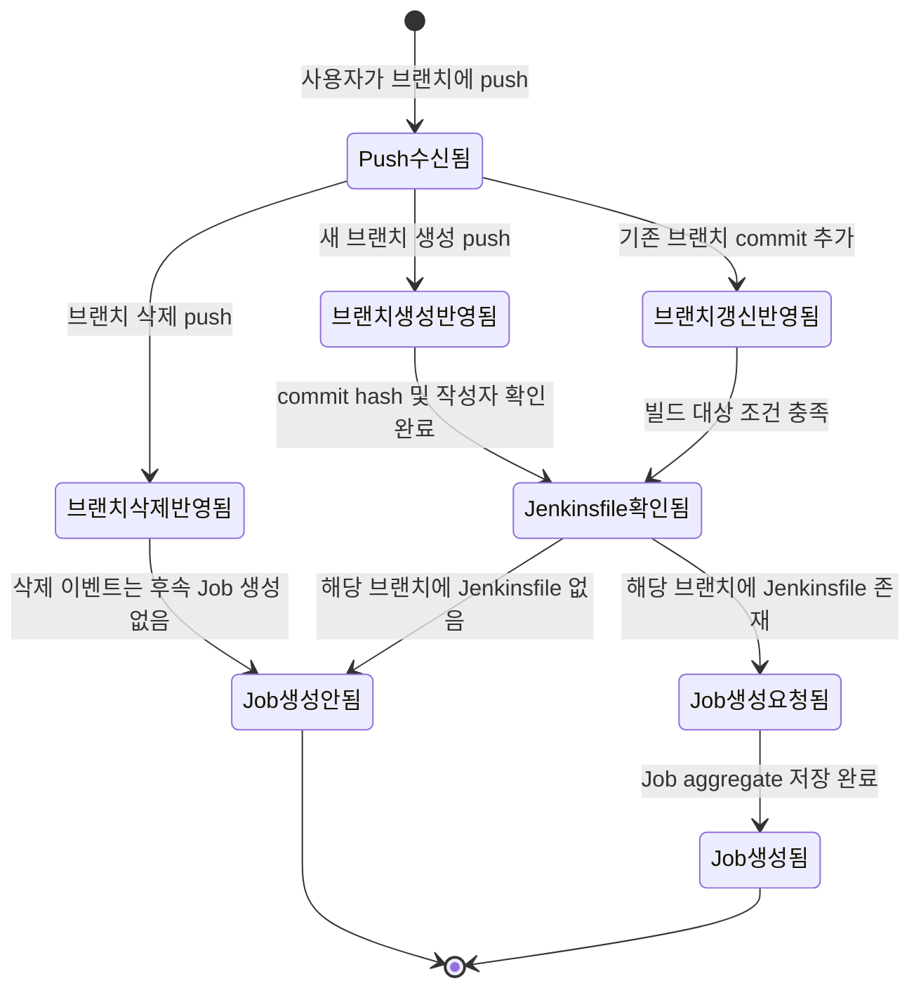
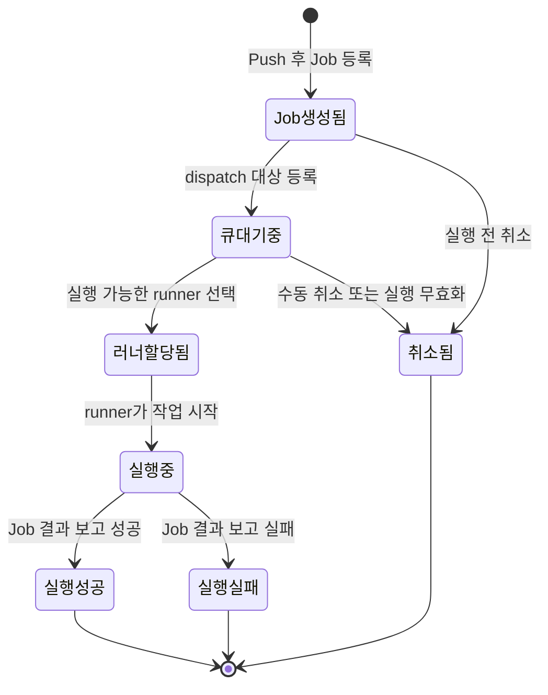

# Job Event Storming

## 목적
- Push 이벤트로부터 Job 생성 및 실행 완료까지 이어지는 핵심 상태 변화와 도메인 이벤트를 정리함.
- 기술 구현체가 아닌 도메인 상태와 전이 조건 중심으로 흐름을 표현함.
- `PushEventHandleService` 리팩토링 시 어떤 상태 전이가 유지되어야 하는지 기준을 제공함.

## 도메인 흐름

### A. Push 에서 Job 생성 요청까지의 상태 변화

<!-- 그리고 기존 브랜치가 이미 있는경우 Jenkinsfile 확인하는 절차로 바로가면 될 것같아. -->

### 보충 설명
- `Jenkinsfile확인됨` 은 기술 구현체 호출 자체를 의미하는 상태가 아니라, 해당 브랜치가 Job 생성 가능한 파이프라인 정의를 가지고 있는지 검증된 상태를 의미함.
- 따라서 Jenkinsfile 존재 여부는 `Job생성요청됨` 직전의 핵심 도메인 판단 단계로 해석하는 것이 적절함.

### B. Job 실행 라이프사이클 상태 변화

## 주요 도메인 이벤트 후보
- `PushReceived`
- `BranchCreatedFromPush`
- `BranchUpdatedFromPush`
- `BranchDeletedFromPush`
- `JenkinsfileVerified`
- `JobRequestedFromPush`
- `JobCreated`
- `JobQueued`
- `RunnerAssigned`
- `JobStarted`
- `JobSucceeded`
- `JobFailed`
- `JobCancelled`

## 해석 기준
- `Push수신됨`, `브랜치생성반영됨`, `브랜치갱신반영됨`, `브랜치삭제반영됨` 은 Push 처리 문맥에서의 상위 상태임.
- `Jenkinsfile확인됨` 은 해당 브랜치가 파이프라인 실행 가능 조건을 충족하는지 판별하는 사전 상태임.
- `Job생성됨` 이후부터는 Job aggregate 라이프사이클로 해석하는 것이 적절함.
- 브랜치 삭제 push 는 현재 정책 기준으로 후속 Job 생성이 발생하지 않는 종료 흐름으로 표현함.
- 향후 정책에 따라 특정 브랜치 제한, Jenkinsfile 경로 다중화, 수동 실행 예외 규칙 등이 추가될 경우 `Jenkinsfile확인됨` 이전 또는 이후의 분기가 확장될 수 있음.

## 비고
- 본 문서는 도메인 상태 전이를 설명하기 위한 문서이며, `PushHook`, `ReceiveCommand`, `UseCase`, `Port` 등 기술 구성요소는 의도적으로 배제함.
