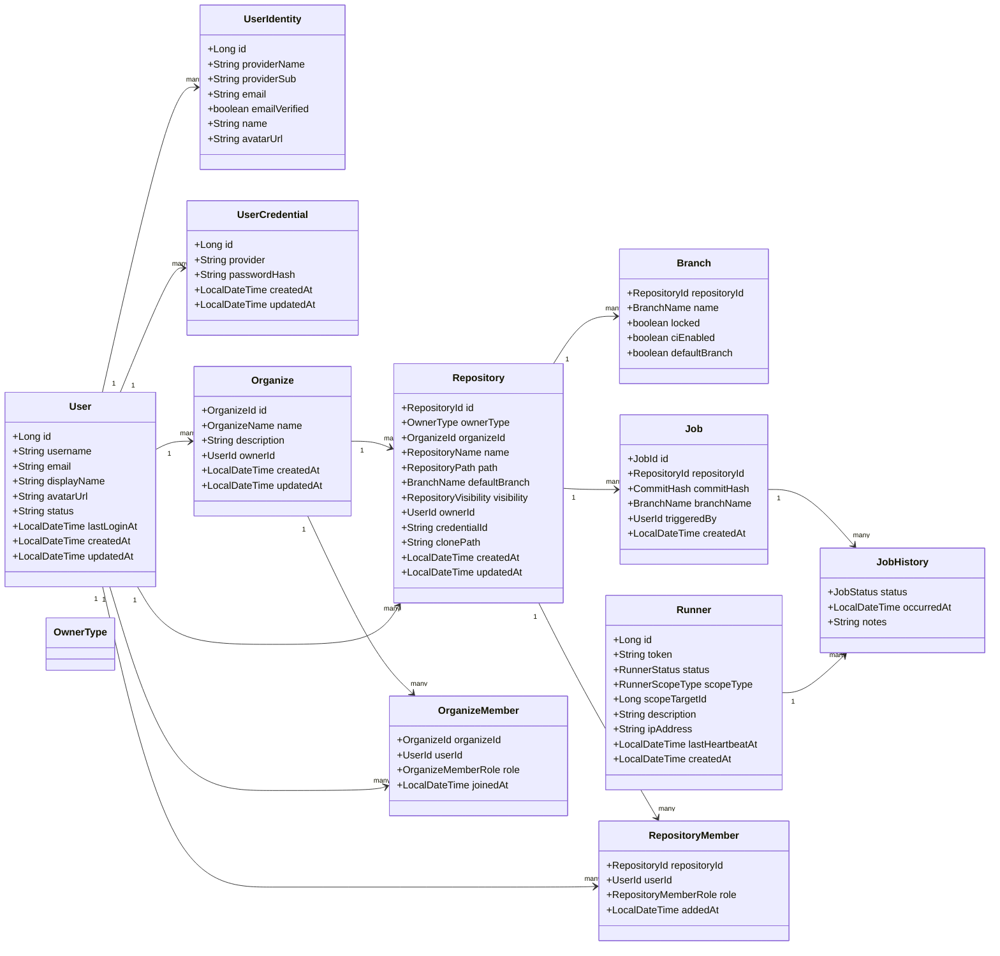
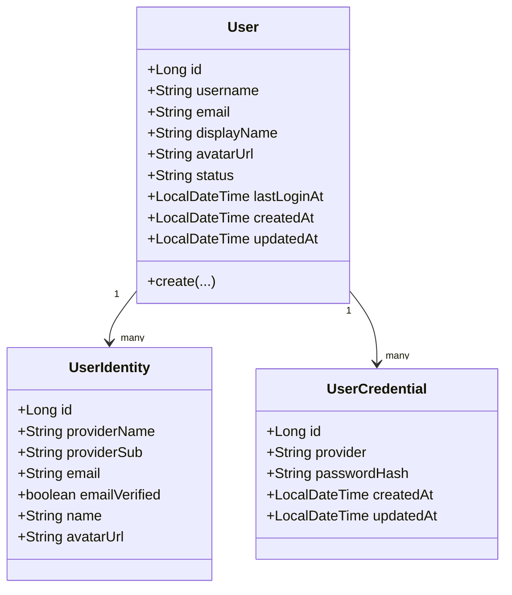
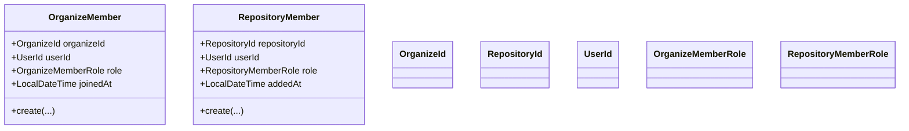
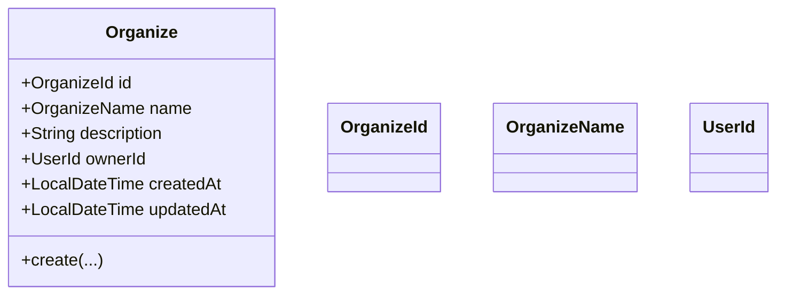
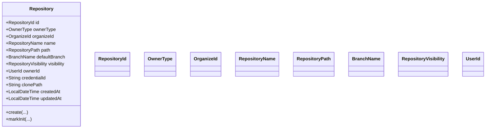
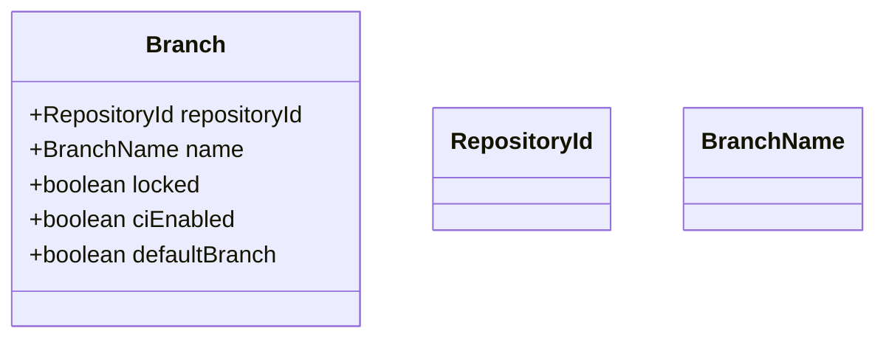
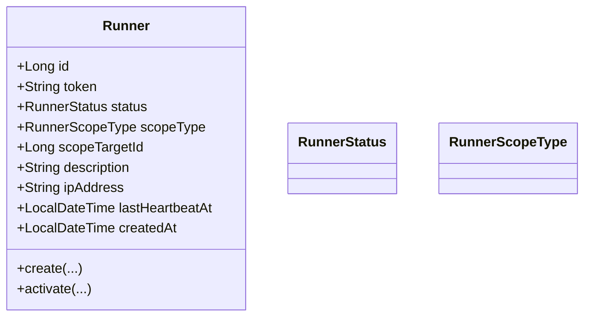
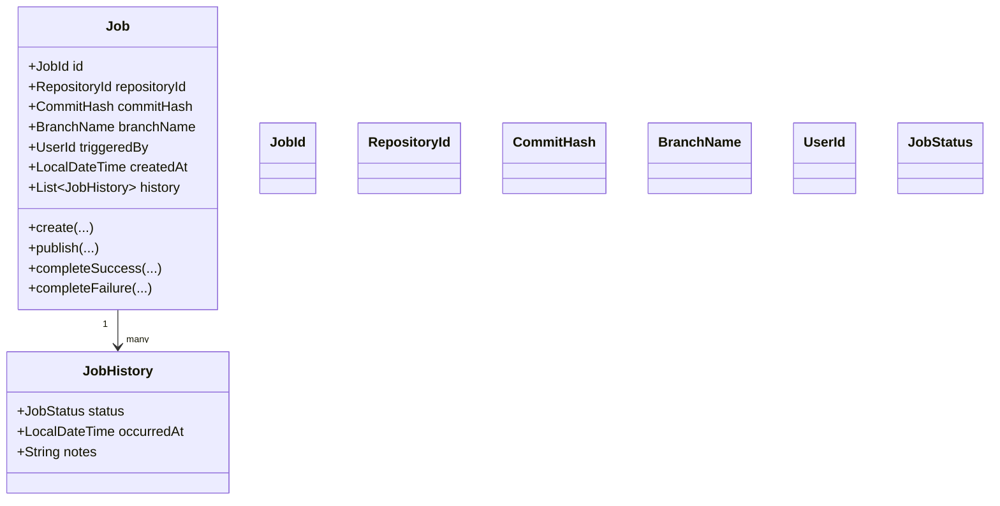

## Overview

### Overall Flow Diagram

### Flow Summary

- A `User` signs in with OAuth and has `UserIdentity` and `UserCredential` for provider and PAT data.
- A `User` owns one or more `Organize` entities as the top-level account boundary.
- A `Repository` is owned by either `Organize` or `User` based on `ownerType`.
- A `Repository` has path, visibility, and default branch. It links to `Branch` and `Job`.
- A `Runner` executes jobs and is tracked by heartbeat.
- Memberships (organize/repository) are separate aggregates used for access control.

## User

## Membership

## Organize

## Repository

## Branch

## Runner

## Job

