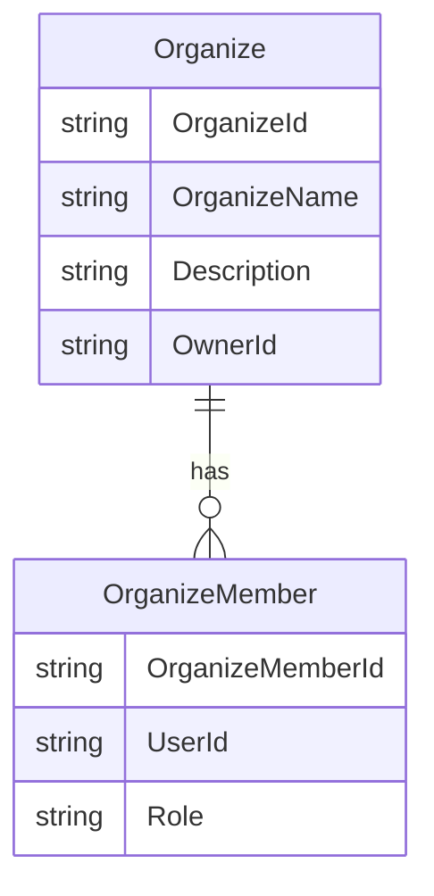
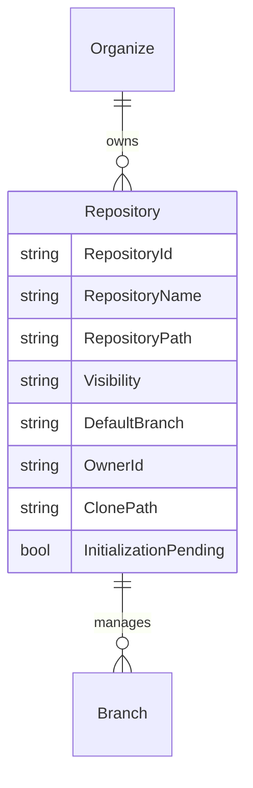
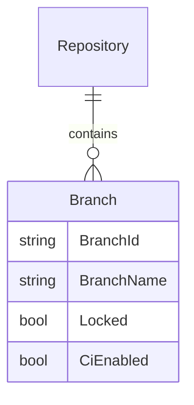
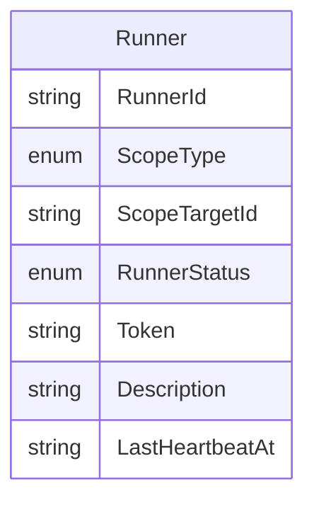
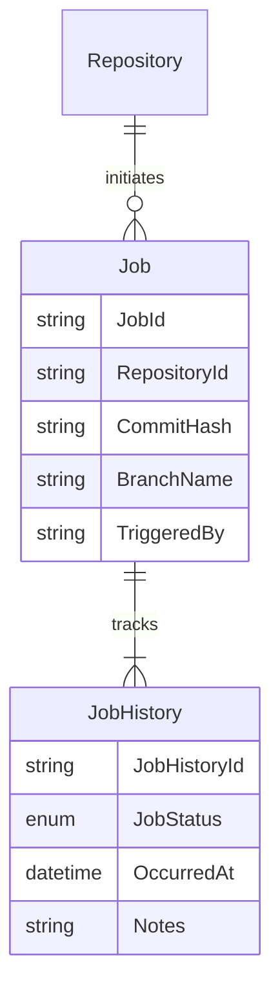
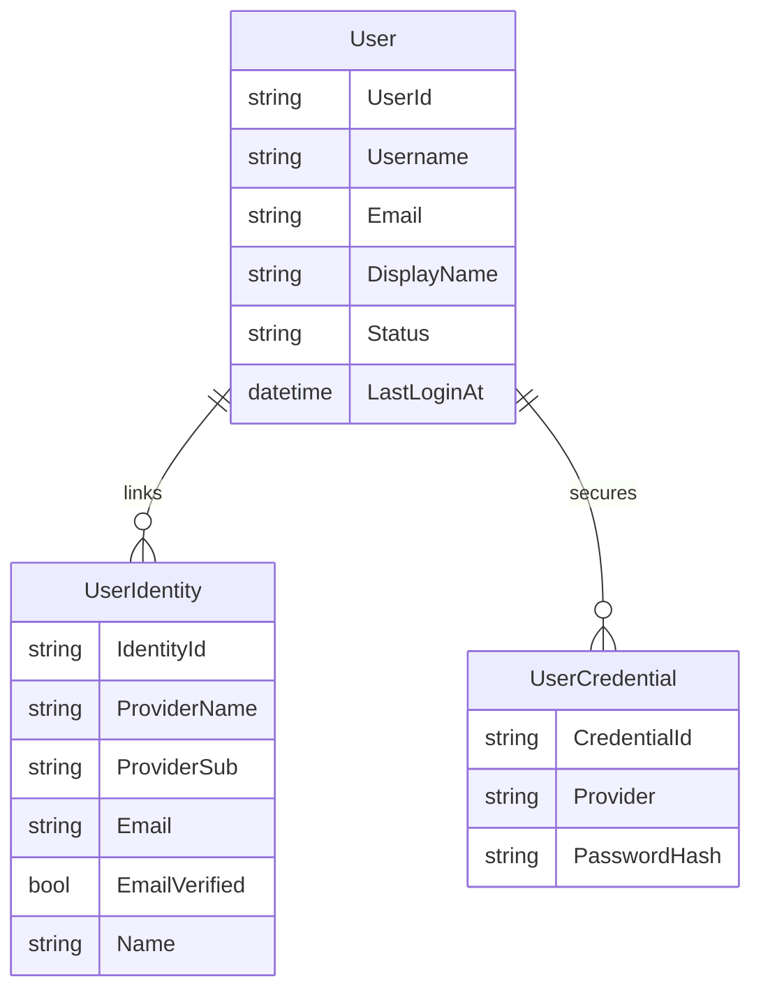
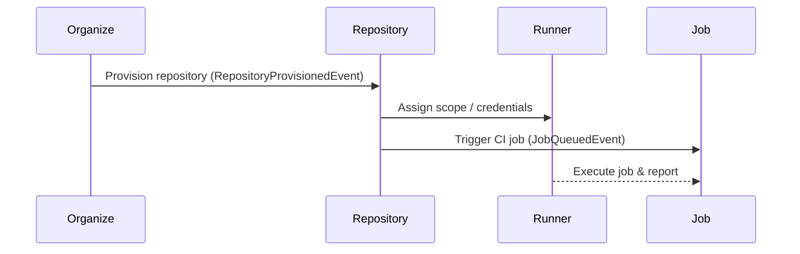

# Domain Aggregates Diagram

## Organize Aggregate

```mermaid
erDiagram
    Organize ||--o{ OrganizeMember : "has"
    Organize {
        string OrganizeId
        string OrganizeName
        string Description
        string OwnerId
    }
    OrganizeMember {
        string OrganizeMemberId
        string UserId
        string Role
    }
```

## Repository Aggregate

```mermaid
erDiagram
    Organize ||--o{ Repository : owns
    Repository ||--o{ Branch : manages
    Repository {
        string RepositoryId
        string RepositoryName
        string RepositoryPath
        string Visibility
        string DefaultBranch
        string OwnerId
        string ClonePath
        bool InitializationPending
    }
```

## Branch Aggregate

```mermaid
erDiagram
    Repository ||--o{ Branch : contains
    Branch {
        string BranchId
        string BranchName
        bool Locked
        bool CiEnabled
    }
```

## Runner Aggregate

```mermaid
erDiagram
    Runner {
        string RunnerId
        enum ScopeType
        string ScopeTargetId
        enum RunnerStatus
        string Token
        string Description
        string LastHeartbeatAt
    }
```

## Job Aggregate

```mermaid
erDiagram
    Repository ||--o{ Job : initiates
    Job ||--|{ JobHistory : tracks
    Job {
        string JobId
        string RepositoryId
        string CommitHash
        string BranchName
        string TriggeredBy
    }
    JobHistory {
        string JobHistoryId
        enum JobStatus
        datetime OccurredAt
        string Notes
    }
```

## User Aggregate

```mermaid
erDiagram
    User ||--o{ UserIdentity : links
    User ||--o{ UserCredential : secures
    User {
        string UserId
        string Username
        string Email
        string DisplayName
        string Status
        datetime LastLoginAt
    }
    UserIdentity {
        string IdentityId
        string ProviderName
        string ProviderSub
        string Email
        bool EmailVerified
        string Name
    }
    UserCredential {
        string CredentialId
        string Provider
        string PasswordHash
    }
```

## Cross-Aggregate Interactions

```mermaid
sequenceDiagram
    participant Org as Organize
    participant Repo as Repository
    participant Runner as Runner
    participant Job as Job

    Org->>Repo: Provision repository (RepositoryProvisionedEvent)
    Repo->>Runner: Assign scope / credentials
    Repo->>Job: Trigger CI job (JobQueuedEvent)
    Runner-->>Job: Execute job & report
```
