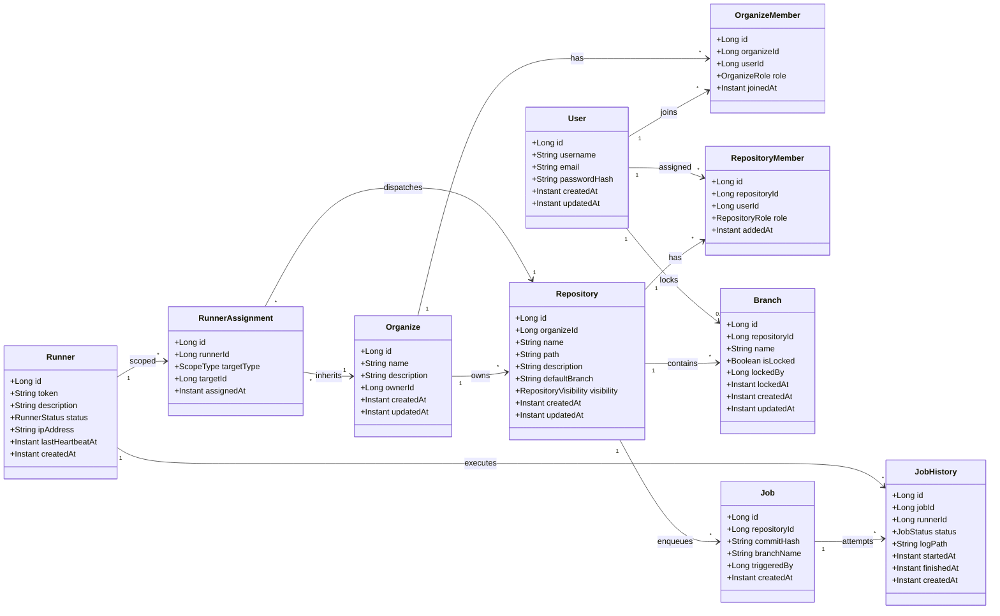

## 도메인 모델 개요
- 상기 클래스 다이어그램은 `data/ERD.md`에 명시된 관계를 그대로 가져오되, 애플리케이션 서비스에서 실제로 다루는 Aggregate 경계를 드러내기 위해 필드와 협력 관계를 도메인 용어로 재정의했다.
- 조직(`Organize`)은 `OrganizeName` 하나만으로 슬러그를 표현하며, 디렉터리 prefix 제약(공백/슬래시/특수문자 금지, 하이픈·언더스코어 허용)을 갖는다.
- 조직과 저장소(`Repository`)는 각각 회원 테이블을 통해 사용자와 연결되며, 저장소 단위의 멤버십이 조직 멤버십보다 더 세밀한 권한 모델을 제공한다.
- 러너(`Runner`)는 독립 엔터티로 존재하며 `RunnerAssignment`를 통해 글로벌, 조직, 저장소 레벨의 작업 실행 범위를 결정한다.
- 잡(`Job`)은 저장소와 커밋 정보를 기준으로 생성되는 불변 요청이고, `JobHistory`는 개별 실행 시도에 대한 상태 추적 및 러너 매핑을 담당한다.

## 애그리게이트 및 핵심 규칙
1. **Organize Aggregate**
   - `Organize` + `OrganizeMember`가 하나의 애그리게이트로 동작한다. 조직 생성자는 자동으로 OWNER로 등록되며, OWNER 이상 권한만이 조직 프로필 수정이나 저장소 생성을 허용받는다.
   - 조직 경로(`path`)와 이름(`name`)은 전역 유일성을 확보해야 하며, 변경 시 관련 저장소 URL도 함께 갱신되는 파급효과를 고려해야 한다.

2. **Repository Aggregate**
   - `Repository`는 기본 브랜치, 가시성, 멤버십으로 구성된 독립 애그리게이트다. 조직과 느슨하게 연결되지만, 권한 검증은 항상 조직→저장소 순으로 내려가며, 저장소의 기본 브랜치 변경은 브랜치 엔터티와의 일관성이 확보된 경우에만 허용된다.
   - `RepositoryMember`는 저장소 정책을 세밀하게 제어하기 위한 별도 엔터티다. 조직 멤버가 아니더라도 저장소 단위 초대가 가능하도록 설계되어 있다.

3. **Branch Aggregate**
   - `Branch`는 별도의 애그리게이트처럼 보이지만 실제로는 저장소와 강하게 연결된다. 브랜치 잠금(lock) 상태는 협업 충돌을 예방하기 위한 핵심 도메인 규칙이며, `locked_by`는 감사 추적을 위해 필수다.
   - 브랜치 생성/삭제는 Git Hook과의 연동을 통해 실제 Git 레퍼런스 상태와 동기화되어야 한다.

4. **Runner Aggregate**
   - `Runner` 자체는 재사용 가능한 리소스로 취급되며, `RunnerAssignment`가 실제 스코프 제약을 표현한다. GLOBAL 스코프인 경우 `target_id`는 null이며, ORGANIZE/REPOSITORY 스코프는 계층적으로 상속된다(예: 저장소에 러너가 없으면 조직 스코프 러너를 찾는다).
   - 러너 상태(`status`)와 마지막 하트비트 시간은 Job 디스패처가 후보군을 선정할 때 가장 먼저 확인하는 신뢰 지표다.

5. **Job Aggregate**
   - `Job`은 특정 커밋/브랜치에 대한 실행 의도만 보존한다. 재시도 혹은 지속 실행은 반드시 `JobHistory`를 통해 관리되며, 하나의 Job에 여러 History가 붙어도 Job 자체는 Mutate되지 않는다.
   - `JobHistory`는 Pending → Running → (Success | Failed | Canceled)로 내려가는 상태 전이 그래프를 가진다. 러너 할당이 지연되면 `runner_id`는 null로 유지되며, 디스패처가 러너를 고른 순간 상태가 Running으로 전환된다.

## 시니어 개발자 관점의 설계 메모
- **권한 계층 명확화**: 사용자→조직→저장소로 내려가는 권한 모델과 러너→스코프→잡으로 이어지는 실행 모델이 서로 맞물리기 때문에, 추후 RBAC 확장 시 두 축을 동시에 검토해야 한다.
- **확장 가능한 러너 스코프**: 현재는 GLOBAL/ORGANIZE/REPOSITORY 세 단계지만, 향후 프로젝트 수준이나 태그 기반 스코프가 필요할 가능성이 있다. `RunnerAssignment`의 `target_type`을 Enum으로 두고, 하위 타입을 확장할 수 있도록 서비스 계층을 느슨하게 구현해야 한다.
- **잡 이력 아카이빙**: `JobHistory`는 실행 로그 경로(`log_path`)만을 들고 있고 실제 로그는 외부 스토리지에 남는다. 장기 보관 정책을 프로젝트 초기에 정의하지 않으면 로그 정합성 문제가 생기므로, TTL 혹은 아카이브 워크플로우를 미리 설계해야 한다.
- **조직/저장소 슬러그 정책**: `path` 필드 중복은 UI/CLI 사용성을 크게 떨어뜨린다. 사전 검증과 충돌 해결 전략(예: 숫자 suffix, 예약어 목록)이 요구된다.
- **브랜치 잠금 감사**: `locked_by`, `locked_at`을 사용한 감사 로그는 배포 안정성과 직결된다. UI에서 잠금 상태를 명확히 드러내고, 자동 해제 정책(예: 일정 시간 후 unlock)을 도입할지 여부를 검토할 필요가 있다.
