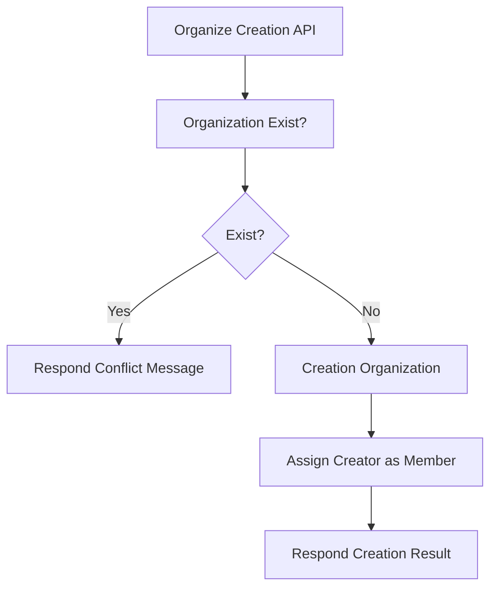
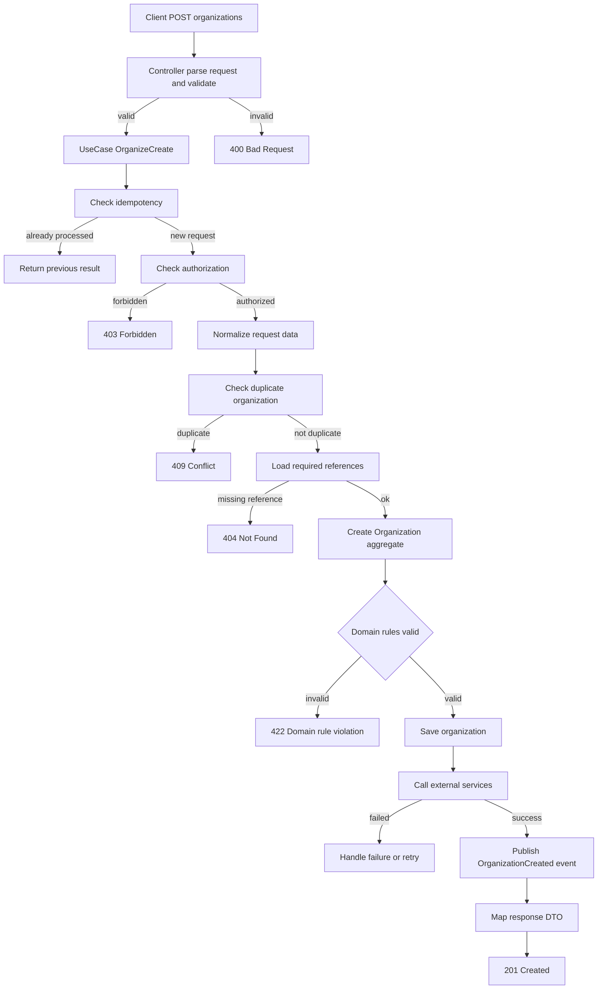
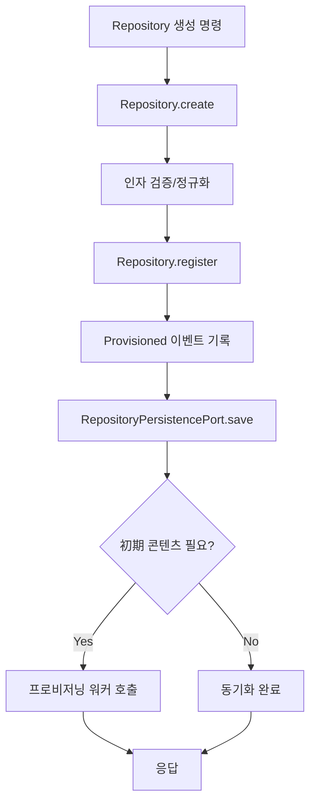

# 도메인별 Use Case 플로우 (Senior Review)

## Organize
### Organize 생성
> 조직을 생성하고, 조직을 생성한 사용자를 조직에 할당.




<br>
<br>
<br>
<br>



## Repository 프로비저닝 & 초기 콘텐츠 플래그


## Runner 등록 & 활성화
```mermaid
flowchart TD
    A[Runner 등록 요청] --> B[Runner.create]
    B --> C[RunnerPersistencePort.save]
    C --> D[Runner.activate(token,ip)]
    D --> E{토큰 유효?}
    E -->|No| F[예외 발생]
    E -->|Yes| G[ONLINE + heartbeat]
    G --> H[RunnerActivatedEvent 기록]
    H --> I[RunnerCommandPort.update]
    I --> J[디스패처 알림]
```

## Job 큐잉 & 히스토리 관리
```mermaid
flowchart TD
    A[JobService.createJob] --> B[Job.create]
    B --> C[초기 JobHistory(PENDING)]
    C --> D[JobPersistencePort.save]
    D --> E[RunnerAllocation 호출]
    E --> F{Runner 할당?}
    F -->|No| G[대기 상태 유지]
    F -->|Yes| H[Job.publish(runnerId)]
    H --> I[JobHistory IN_PROGRESS]
    I --> J[JobQueuedEvent 기록]
    J --> K[JobPersistencePort.update]
    K --> L[Dispatcher 알림]
```
